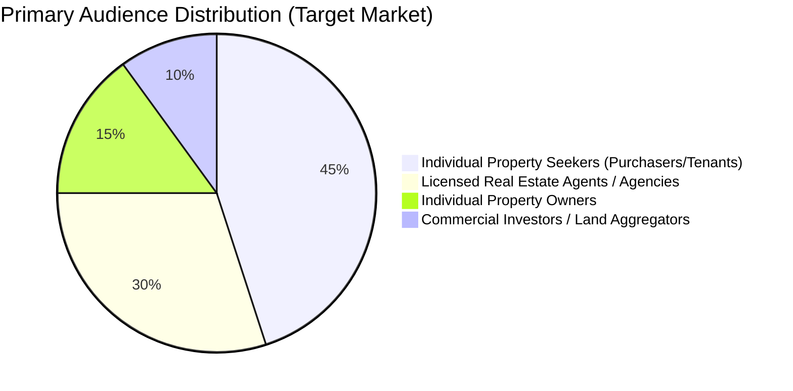
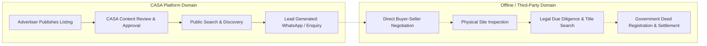
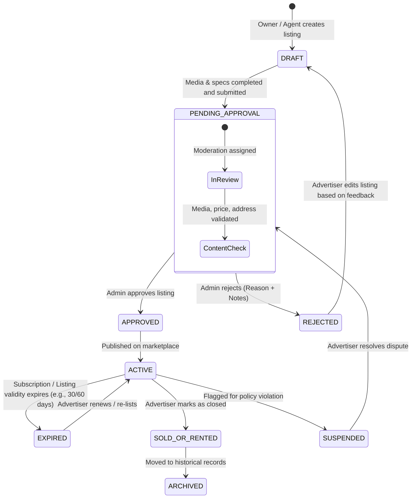
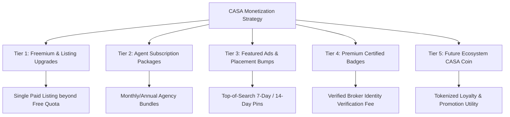

# CASA — Business Requirements Document (BRD)

## 1. Executive Summary & Business Vision
CASA is a high-growth, digital real estate marketplace designed to revolutionize property discovery, advertisement, and enquiry across diverse urban and rural regional demographics. Inspired by the frictionless classifieds model pioneered by OLX, CASA provides property owners and real estate agents with high-visibility listing channels while empowering buyers, tenants, and commercial investors with transparent, multilingual, and location-precise discovery tools.

The long-term vision positions CASA as an integrated digital ecosystem spanning property classifieds, agent marketing SaaS, certified property services, and a community-driven loyalty framework (CASA Main Coin).

---

## 2. Target Audience Personas



### 1. The Individual Property Seeker (Purchaser / Tenant)
- **Profile:** Mobile-first users seeking residential apartments, rental homes, retail shops, or small land parcels.
- **Pain Points:** Misleading prices, outdated listings, language barriers, complex map interfaces, spam calls from unsolicited brokers.
- **Key Needs:** Verified mobile OTP login, multilingual localized browsing (English, Hindi, Arabic, Urdu), direct WhatsApp advertiser communication, saved favourite shortlists, and accurate price/amenity filters.

### 2. The Individual Property Owner
- **Profile:** Private owners selling or leasing a family home, plot, or commercial shop without large brokerage retainers.
- **Pain Points:** High listing fees on legacy portals, complex multi-step upload forms, slow listing approval times.
- **Key Needs:** Simple 3-step listing creation, direct media uploads via smartphone, instant status updates on listing approval, direct buyer lead inquiries.

### 3. The Professional Real Estate Agent / Agency
- **Profile:** Independent brokers and localized property consultancy agencies managing 10–100+ active inventories.
- **Pain Points:** High lead acquisition costs, lack of dedicated brand showcase, difficult inventory status tracking.
- **Key Needs:** Agent subscription packages, batch listing management, verified agent trust badge, featured listing bumps, direct lead analytics, and Calendly viewing links.

### 4. The Platform Operations Administrator
- **Profile:** Internal CASA operations and trust & safety team members.
- **Pain Points:** Fraudulent listings, copyright-violating images, fake prices, spam accounts, disputed ownership listings.
- **Key Needs:** Streamlined moderation queue with side-by-side media reviews, internal private audit notes, instant one-click approval/rejection with pre-filled feedback templates, category/taxonomy controls, and granular audit logging.

---

## 3. Marketplace Operating Model & Demarcation

### Lead Generation vs. Transaction Processing Demarcation

> [!CRITICAL]
> **Boundary Definition: Lead Generation Engine vs. Real Estate Brokerage/Escrow**
> CASA operates strictly as a **Digital Marketplace & Lead Generation Platform**. CASA does **NOT** act as a licensed real estate broker, escrow settlement agent, title insurance provider, or legal registrar.
>
> 1. **What CASA DOES:**
>    - Aggregates and publishes property advertisements.
>    - Indexes listings for discovery via search, spatial coordinates, and category filters.
>    - Channels verified leads from purchasers to advertisers via WhatsApp, phone, and in-platform enquiry tickets.
>    - Collects platform monetization fees (listing upgrades, subscription tiers, featured placements).
> 2. **What CASA DOES NOT DO:**
>    - CASA does not process property purchase deposits, escrow payments, or sale considerations.
>    - CASA does not execute government land title registrations or deed ownership transfers.
>    - CASA does not guarantee legal title validity or physical structural condition of advertised properties.



---

## 4. User Acquisition & Growth Model
1. **Low-Friction Mobile Onboarding:** Instant OTP authentication eliminates password fatigue and accelerates conversion.
2. **Organic Localized SEO:** Next.js Server-Side Rendering (SSR) generates dynamic, location-specific landing pages (e.g., `casa.com/en/flats-for-sale/lucknow/gomti-nagar`) across 4 languages.
3. **Freemium Listing Incentive:** Free initial listing allowance for individual owners to seed rapid regional inventory growth.
4. **Agent Tier Subscriptions:** Scalable monthly/annual tiers offering higher listing limits, priority moderation, and prominent agent branding.
5. **Direct Social Sharing:** Rich OpenGraph preview cards for seamless listing distribution across WhatsApp groups and social networks.

---

## 5. Property Listing Lifecycle & Moderation Workflow

Every property advertisement follows a deterministic state-machine workflow to ensure high marketplace quality and spam prevention:



### Detailed Lifecycle Stages:
1. **Draft (`DRAFT`):** Listing is being composed by the advertiser. Invisible to the public and admin review queue.
2. **Pending Approval (`PENDING_APPROVAL`):** Submitted to the admin moderation queue. Locked from direct edits unless recalled by author.
3. **Approved / Active (`ACTIVE`):** Admin verified; fully indexed in search and geospatial queries.
4. **Rejected (`REJECTED`):** Admin marked listing as non-compliant. Specific rejection codes (e.g., `INVALID_PRICE`, `COPYRIGHT_MEDIA`, `INACCURATE_LOCATION`) and private admin notes are stored; public user receives actionable feedback.
5. **Expired (`EXPIRED`):** Standard listing validity duration (e.g. 30, 60, or 90 days) reached. Listing ceases to appear in public search until renewed.
6. **Sold / Rented (`SOLD_OR_RENTED`):** Advertiser marks the transaction as concluded. The listing is removed from active discovery to preserve search relevance.
7. **Suspended (`SUSPENDED`):** Triggered automatically by excessive user spam flags or manually by Admin during fraud investigations.

---

## 6. Revenue & Monetization Strategy

CASA leverages a multi-stream monetization engine designed for gradual rollout across operational phases:



### Monetization Models:
1. **Pay-Per-Listing (Beyond Free Quota):** Individual owners receive 1–2 free active listings. Additional listings require a one-time publishing fee.
2. **Featured / Promoted Bumps:** Advertisers pay a micro-fee (via Razorpay) to pin their property to the top of category search results or homepage carousels for 7, 14, or 30 days.
3. **Agent Subscription Tiers:**
   - *Starter Broker:* 10 Active Listings, Standard Moderation.
   - *Professional Agency:* 50 Active Listings, Priority 2-hour Moderation, Agent Profile Page, Calendly Integration.
   - *Enterprise Developer:* Unlimited Listings, Dedicated Account Manager, Homepage Banner Placements.
4. **Direct Verified Listing Badges:** Paid physical/documentary verification services where CASA operations confirm physical property availability.

---

## 7. Future Ecosystem Vision: CASA Main Coin

```mermaid
graph LR
    subgraph CASA Core Platform
        A[User Actions: Referral / Activity / Verified Listing] -->|Rewards Engine| B[CASA Coin Credit Balance]
        B -->|Redeem For| C[Platform Perks: Featured Ads / Subscriptions]
    end
    subgraph Future Phase Architecture (Phase 18)
        B -.-> D[External Token Bridge / Web3 Infrastructure]
        D -.-> E[Community Governance / Ecosystem Partnerships]
    end
```

### Strategic Positioning:
CASA Main Coin is architected as an extensible, phase-isolated loyalty and engagement framework. 
- In **Phase 01–16**, it is strictly an internal virtual ledger for user engagement points, reward bonuses, and referral perks.
- In **Phase 18**, subject to comprehensive legal, financial, and regulatory compliance clearance, it can bridge into a broader digital utility token ecosystem.
- No investment promises, guaranteed financial returns, fiat liquidation, or staking products are supported or planned within the initial application scope.

---

## 8. Business Assumptions & Unresolved Questions

### Core Business Assumptions:
1. **Mobile Dominance:** Over 85% of traffic in target regions will access CASA via mobile browsers; UI and UX must be rigorously mobile-first.
2. **WhatsApp as Primary Channel:** Direct conversational messaging via WhatsApp converts 3x higher than static email forms in the local real estate market.
3. **Admin Verification Feasibility:** Platform operations will maintain internal staff capable of reviewing pending listings within a target SLA of 4–12 hours.

### Unresolved Business Questions:
1. *What are the finalized pricing tiers for Agent Subscriptions and Featured Listing boosts?*
2. *Will individual property owners be granted 1 or 2 free lifetime listings before requiring payment?*
3. *What is the exact legal liability disclaimer required for the specialized "Litigated" property category in target jurisdictions?*
4. *Which SMS aggregator provides the most cost-effective DLT-approved OTP routing for target domestic regions?*
