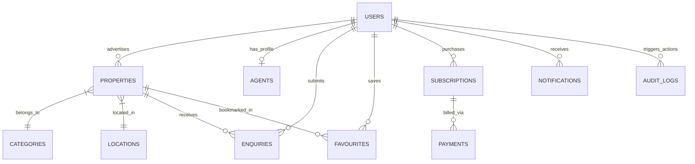

# CASA — Database Architecture & Data Blueprint

## 1. Architectural Strategy & Technology Selection

CASA utilizes **MongoDB Atlas** as its primary document persistence store, managed via Mongoose in the NestJS application layer.

### Key Architectural Tenets:
1. **Document-Oriented Flexibility:** Diverse real estate categories (agriculture, residential flats, litigated auctions) require dynamic attributes without complex relational join penalties.
2. **Native Geospatial Indexing:** Direct execution of `$near` and `$geoWithin` spherical queries using MongoDB `2dsphere` indexes.
3. **Compound Read Optimization:** High-frequency query patterns (e.g. `category + city + price + status = ACTIVE`) are pre-indexed to ensure sub-50ms query latency.
4. **Defense-in-Depth Privacy:** Admin-only internal fields and audit trails are isolated or cleanly projected out of all public query contexts.

---

## 2. Comprehensive Collection Blueprints

### 2.1 Collection: `users`
- **Purpose:** Central account record for all actors (Purchasers, Owners, Agents, Admins).
- **Key Fields:** `_id`, `mobileNumber` (E.164, unique), `countryCode`, `fullName`, `email`, `role` (`SUPER_ADMIN`, `ADMIN`, `MODERATOR`, `AGENT`, `PROPERTY_OWNER`, `PURCHASER`), `preferredLanguage` (`en`, `hi`, `ar`, `ur`), `isVerified`, `isActive`, `lastLoginAt`, `createdAt`.
- **Indexes:**
  - `{ mobileNumber: 1 }` (Unique)
  - `{ email: 1 }` (Sparse, Unique)
  - `{ role: 1, isActive: 1 }` (Compound)
- **Lifecycle:** Soft deletion via `deletedAt` timestamp; active sessions terminated upon deactivation.

---

### 2.2 Collection: `agents`
- **Purpose:** Extended business profile and verification metadata for real estate brokers and agencies.
- **Key Fields:** `_id`, `userId` (Ref: `users`), `agencyName`, `reraNumber`, `licenseNumber`, `experienceYears`, `bio`, `operatingCities`, `verificationStatus` (`PENDING`, `VERIFIED`, `REJECTED`), `verificationDocs` (Array of secure media URLs), `calendlyUrl`, `activeListingQuota`, `createdAt`.
- **Indexes:**
  - `{ userId: 1 }` (Unique)
  - `{ verificationStatus: 1 }`
  - `{ reraNumber: 1 }` (Sparse)

---

### 2.3 Collection: `properties`
- **Purpose:** Core inventory of property advertisements.
- **Key Fields:** `_id`, `slug` (Unique), `title` (Localized), `description` (Localized), `categoryId` (Ref: `categories`), `listingType`, `price` (Amount, Currency, Negotiable), `location` (State, District, City, Locality, Coordinates), `specs` (Area, Beds, Baths, Status, Age), `media` (Images, Floorplans), `youtubeVideoUrl`, `advertiser` (UserId, Role), `approvalStatus`, `status`, `promotion` (isFeatured, expiresAt), `adminData` (Remarks, ReviewerId), `createdAt`.
- **Indexes:**
  - `{ "location.coordinates": "2dsphere" }` (Geospatial proximity)
  - `{ status: 1, approvalStatus: 1, "location.city": 1, categoryId: 1, "price.amount": 1 }` (Primary Discovery Compound)
  - `{ slug: 1 }` (Unique)
  - `{ "advertiser.userId": 1, status: 1 }` (User Dashboard)
  - `{ "promotion.isFeatured": -1, createdAt: -1 }` (Sorting & Freshness)
  - `{ "title.en": "text", "description.en": "text", "title.hi": "text" }` (Full-Text Search)

---

### 2.4 Collection: `categories`
- **Purpose:** Dynamic configuration of property types, attribute constraints, and multi-language labels.
- **Key Fields:** `_id`, `slug` (Unique), `name` (Localized: en, hi, ar, ur), `iconKey`, `group` (`RESIDENTIAL`, `COMMERCIAL`, `LAND`, `SPECIALIZED`), `requiredAttributes` (Array of string keys), `sortOrder`, `isActive`.
- **Indexes:**
  - `{ slug: 1 }` (Unique)
  - `{ isActive: 1, sortOrder: 1 }`

---

### 2.5 Collection: `locations`
- **Purpose:** Standardized administrative location taxonomy (State > District > City > Locality) to prevent spelling fragmentation.
- **Key Fields:** `_id`, `state`, `district`, `city`, `locality`, `pincode`, `coordinates` (GeoJSON Point), `isActive`.
- **Indexes:**
  - `{ state: 1, city: 1, locality: 1 }` (Compound Unique)
  - `{ city: 1, isActive: 1 }`
  - `{ coordinates: "2dsphere" }`

---

### 2.6 Collection: `enquiries`
- **Purpose:** Direct property lead tickets submitted by prospective buyers.
- **Key Fields:** `_id`, `propertyId` (Ref: `properties`), `senderId` (Ref: `users`, optional), `senderName`, `senderPhone`, `senderEmail`, `advertiserId` (Ref: `users`), `message`, `status` (`NEW`, `READ`, `CONTACTED`, `CLOSED`), `source` (`FORM`, `WHATSAPP_CLICK`), `createdAt`.
- **Indexes:**
  - `{ advertiserId: 1, status: 1, createdAt: -1 }` (Agent Lead Inbox)
  - `{ propertyId: 1, createdAt: -1 }`
  - `{ senderPhone: 1, createdAt: -1 }` (Spam rate monitoring)

---

### 2.7 Collection: `favourites`
- **Purpose:** User property bookmark and shortlist ledger.
- **Key Fields:** `_id`, `userId` (Ref: `users`), `propertyId` (Ref: `properties`), `createdAt`.
- **Indexes:**
  - `{ userId: 1, propertyId: 1 }` (Compound Unique)
  - `{ userId: 1, createdAt: -1 }`

---

### 2.8 Collection: `subscriptions`
- **Purpose:** Commercial subscription packages and listing quota ledger for agents.
- **Key Fields:** `_id`, `userId` (Ref: `users`), `tierCode` (`FREE_STARTER`, `BROKER_PRO`, `AGENCY_ELITE`), `listingQuota`, `featuredQuota`, `pricePaid`, `currency`, `startDate`, `expiresAt`, `status` (`ACTIVE`, `EXPIRED`, `CANCELLED`), `razorpaySubscriptionId`.
- **Indexes:**
  - `{ userId: 1, status: 1 }`
  - `{ expiresAt: 1, status: 1 }` (Automated cron expiration check)

---

### 2.9 Collection: `payments`
- **Purpose:** Immutable financial transaction records from payment gateway webhooks.
- **Key Fields:** `_id`, `userId` (Ref: `users`), `orderId` (Razorpay Order ID), `paymentId` (Razorpay Payment ID), `amount`, `currency`, `purpose` (`SUBSCRIPTION`, `FEATURED_BOOST`, `VERIFICATION_FEE`), `targetEntityId` (PropertyId or SubscriptionId), `status` (`INITIATED`, `SUCCESS`, `FAILED`, `REFUNDED`), `rawGatewayPayload`, `createdAt`.
- **Indexes:**
  - `{ orderId: 1 }` (Unique)
  - `{ paymentId: 1 }` (Sparse, Unique)
  - `{ userId: 1, createdAt: -1 }`

---

### 2.10 Collection: `notifications`
- **Purpose:** In-app user notifications and system alerts.
- **Key Fields:** `_id`, `recipientId` (Ref: `users`), `type` (`LISTING_APPROVED`, `LISTING_REJECTED`, `NEW_ENQUIRY`, `SUBSCRIPTION_EXPIRING`), `title`, `body`, `targetUrl`, `isRead`, `createdAt`.
- **Indexes:**
  - `{ recipientId: 1, isRead: 1, createdAt: -1 }`
  - `{ createdAt: 1 }` (TTL: 90 days retention)

---

### 2.11 Collection: `media`
- **Purpose:** Metadata tracking for all assets uploaded to ImageKit CDN.
- **Key Fields:** `_id`, `uploaderId` (Ref: `users`), `fileId` (ImageKit ID), `url`, `thumbnailUrl`, `mimeType`, `sizeBytes`, `dimensions` (width, height), `associatedPropertyId`, `status` (`ACTIVE`, `ORPHANED`, `DELETED`), `createdAt`.
- **Indexes:**
  - `{ fileId: 1 }` (Unique)
  - `{ associatedPropertyId: 1 }`
  - `{ uploaderId: 1, createdAt: -1 }`

---

### 2.12 Collection: `auditLogs`
- **Purpose:** Append-only security and operational audit trail for compliance.
- **Key Fields:** `_id`, `actorId` (Ref: `users`), `actorRole`, `action` (`LISTING_APPROVED`, `USER_BANNED`, `CATEGORY_UPDATED`, `PRICE_MODIFIED`), `targetCollection`, `targetDocumentId`, `previousState`, `newState`, `ipAddress`, `userAgent`, `timestamp`.
- **Indexes:**
  - `{ timestamp: -1 }`
  - `{ actorId: 1, timestamp: -1 }`
  - `{ targetDocumentId: 1, timestamp: -1 }`

---

## 3. High-Performance Indexing Strategy Table

| Collection | Index Definition | Type | Architectural Objective |
| :--- | :--- | :--- | :--- |
| `properties` | `{ "location.coordinates": "2dsphere" }` | Geospatial | Sub-50ms radial distance queries (`$near`, `$geoWithin`). |
| `properties` | `{ status: 1, approvalStatus: 1, "location.city": 1, categoryId: 1, "price.amount": 1 }` | Compound | Zero-scan multi-filter discovery for high-volume marketplace search. |
| `properties` | `{ "promotion.isFeatured": -1, createdAt: -1 }` | Compound | Instant sorting of featured bumps followed by fresh listings. |
| `properties` | `{ "title.en": "text", "description.en": "text", "title.hi": "text" }` | Full-Text | Fast keyword matching across multilingual text fields. |
| `users` | `{ mobileNumber: 1 }` | Unique | Instant O(1) OTP identity lookup. |
| `enquiries` | `{ advertiserId: 1, status: 1, createdAt: -1 }` | Compound | Fast rendering of agent lead inbox with unread counts. |
| `notifications` | `{ createdAt: 1 }` (expireAfterSeconds: 7776000) | TTL | Automated 90-day data lifecycle purge without background worker cron overhead. |

---

## 4. Backup, Replication & Disaster Recovery Strategy

1. **MongoDB Atlas Multi-Zone Replica Sets:** Standard 3-node replica set (`Primary-Secondary-Secondary`) distributed across availability zones for zero-downtime automated failover.
2. **Continuous Continuous Cloud Backups:** Point-in-time recovery (PITR) enabled with 7-day retention for rapid recovery from accidental human or logical corruption.
3. **Daily Snapshot Retention:** Automated daily snapshots retained for 30 days; weekly snapshots retained for 12 months for compliance.
4. **Data Isolation & Soft Delete Strategy:** User and Property documents undergo soft deletion (`status = 'DELETED'`, `deletedAt = ISODate()`) with a 30-day recovery grace period before anonymized purging.
