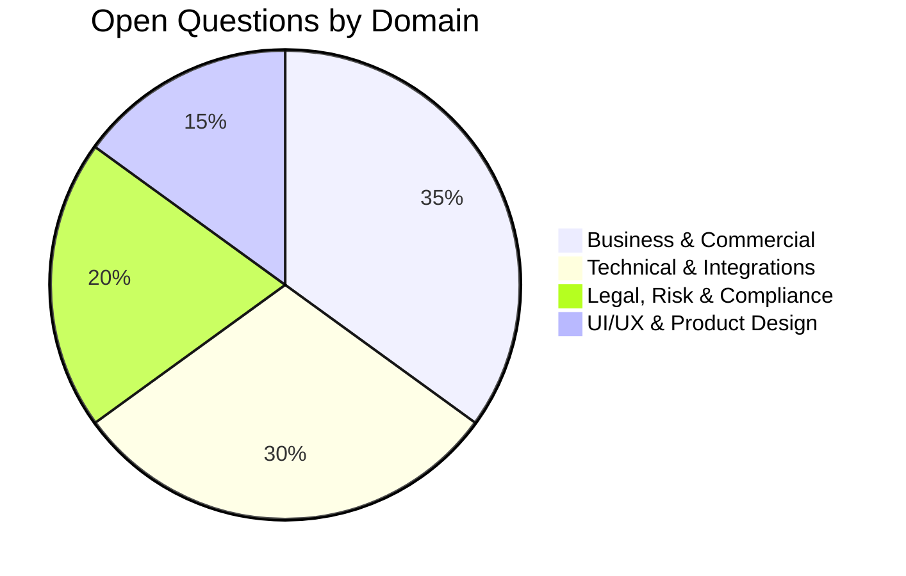

# CASA — Open Questions & Decision Catalog

## 1. Overview & Decision Framework

This catalog tracks all pending business, commercial, technical, and legal decisions that require formal stakeholder review and sign-off during subsequent development phases.

---

## 2. Actionable Open Questions Registry

### 2.1 Business & Commercial Domain

| ID | Title & Summary | Options / Trade-offs | Recommended Baseline | Owner | Priority | Status |
| :--- | :--- | :--- | :--- | :--- | :---: | :---: |
| **Q-BUS-001** | **Individual Property Owner Free Listing Allowance** How many free active advertisements should an individual private property owner be granted? | **Option A:** 1 Free Lifetime Listing. **Option B:** 2 Free Active Listings at any time. **Option C:** 1 Free Listing renewed every 30 days. | **Option B (2 Active Listings):** Accelerates early inventory growth without facilitating commercial broker abuse. | Product / Business Lead | `P0` | Open |
| **Q-BUS-002** | **Agent Subscription Pricing & Boost Tariffs** What are the exact localized fee structures for monthly broker tiers and featured listing bumps? | **Option A:** Fixed flat pricing across all categories. **Option B:** Dynamic tiered pricing based on property valuation / city tier. | **Option A (Fixed Tiers for MVP):** ₹999/mo (Starter), ₹2,999/mo (Pro), ₹299 (7-Day Featured Bump). | Commercial / Finance Lead | `P1` | Open |
| **Q-BUS-003** | **Advertiser Contact Phone Number Visibility** Should advertiser direct phone numbers be displayed publicly or gated behind an OTP login? | **Option A:** Publicly visible to all visitors. **Option B:** Gated behind free OTP login. **Option C:** Masked / Virtual forwarding numbers. | **Option B (Gated behind OTP):** Protects advertisers from automated web scraping bots while converting casual visitors into registered leads. | Product / Trust & Safety | `P0` | Open |

---

### 2.2 Technical & Integrations Domain

| ID | Title & Summary | Options / Trade-offs | Recommended Baseline | Owner | Priority | Status |
| :--- | :--- | :--- | :--- | :--- | :---: | :---: |
| **Q-TECH-001** | **SMS Gateway Vendor Selection for DLT Compliance** Which SMS provider should be contracted for primary transactional OTP delivery in India? | **Option A:** MSG91 (High India DLT reliability). **Option B:** Twilio (Global reach, higher India cost). **Option C:** Fast2SMS / Kaleyra. | **Option A (MSG91) + Mock Dev Adapter:** Native DLT template management and cost-efficiency. | Tech Lead / DevOps | `P0` | Open |
| **Q-TECH-002** | **Ola Maps API Feasibility & Commercial Availability** Does Ola Maps offer reliable SLA, self-service developer billing, and comprehensive geocoding? | **Option A:** Sole dependency on Ola Maps. **Option B:** Mapbox as primary with Ola Maps evaluation. **Option C:** Hot-swappable Geocoding Adapter pattern. | **Option C (Adapter Pattern):** Build against generic interface; benchmark Ola Maps in Phase 11; hot-swap to Mapbox if required. | Lead Architect | `P1` | Open |
| **Q-TECH-003** | **Disambiguation of "Old vs. New" Discovery Filter** How should the ambiguous "Old vs New" search filter be presented to property seekers? | **Option A:** Exclusively filter by Listing Publication Date. **Option B:** Exclusively filter by Property Construction Age. **Option C:** Explicitly separate into two distinct filters. | **Option C (Dual Dimension):** Provide "Freshness" (`<7 days`) AND "Property Age" (`Ready to Move`, `Resale`, `Under Construction`). | UI/UX Lead | `P0` | Open |

---

### 2.3 Legal, Regulatory & Risk Domain

| ID | Title & Summary | Options / Trade-offs | Recommended Baseline | Owner | Priority | Status |
| :--- | :--- | :--- | :--- | :--- | :---: | :---: |
| **Q-LEG-001** | **Legal Liability for "Litigated" Property Category** What legal disclaimers and advertiser indemnities are required when listing bank auction or disputed properties? | **Option A:** Prohibit litigated listings entirely. **Option B:** Allow with mandatory disclaimer modal & advertiser indemnity checkbox. | **Option B (Explicit Disclaimers):** Mandate signed indemnity and explicit disclaimer stating CASA does not verify title. | Legal Counsel | `P0` | Open |
| **Q-LEG-002** | **CASA Main Coin Regulatory Classification** How should CASA Main Coin be structured to avoid cryptocurrency / security token regulations? | **Option A:** On-chain cryptocurrency token. **Option B:** Internal virtual loyalty points ledger (non-fiat convertible). | **Option B (Closed Virtual Points):** Maintain points strictly within internal closed-loop platform ledger until regulatory licenses are obtained. | Legal / Compliance | `P1` | Open |

---

## 3. Decision Sign-Off Protocol

When a stakeholder resolves an open question:
1. Update the **Status** field from `Open` to `Resolved`.
2. Record the **Decision Date** and **Approving Stakeholder**.
3. Propagate the decision into the respective specification documents (`BRD`, `SRS`, or `Data Model`).
