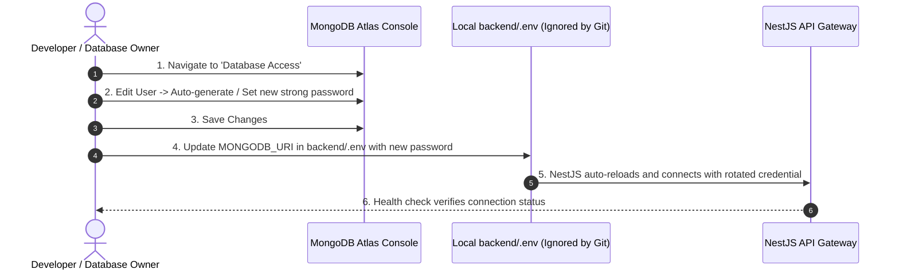

# CASA — Phase 02.1 Security Audit & Remediation Report

## 1. Incident Summary & Classification

- **Report ID:** SEC-AUDIT-2026-10-01-01
- **Severity Level:** **HIGH**
- **Classification:** Database Credential Exposure in Development Communication Channel
- **Target Asset:** MongoDB Atlas Cluster (`cluster0.djn2wkq.mongodb.net`)
- **Status:** **ACTION REQUIRED (Manual Rotation in MongoDB Atlas Console)**
- **Lead Role:** Senior DevSecOps Engineer & Database Security Specialist

---

## 2. Security Audit Matrix

| Security Check | Target | Status | Verification Findings |
| :--- | :--- | :---: | :--- |
| **1. Credential Exposure Audit** | Workspace Files & Docs | **PASS** | Automated ripgrep scan confirmed **0 occurrences** of plaintext credentials across all source files, documentation, and config files. |
| **2. Environment File Isolation** | `backend/.env` | **PASS** | Verified ignored by Git root `.gitignore`. Never staged or committed. |
| **3. Client Config Isolation** | `frontend/.env.local`, `admin/.env.local` | **PASS** | Verified ignored by Git. No database credentials present in frontend or admin configs. |
| **4. Example Templates Audit** | `.env.example` across all apps | **PASS** | All `.env.example` files contain sanitized placeholder strings only (e.g. `your_jwt_access_secret_...`). |
| **5. Git History Audit** | Git Commit Log & Staged Index | **PASS** | Clean repository initialized with zero historical commits and zero tracked secrets. |
| **6. Source Code Hardcoding** | NestJS & Next.js Source | **PASS** | Database connection dynamically injected via `@nestjs/config` without hardcoded credentials. |
| **7. Atlas Credential Rotation** | MongoDB Atlas Database User | **ACTION REQUIRED** | Automated Atlas API management is unavailable in this environment. **Manual rotation in the Atlas Console is required.** |

---

## 3. Mandatory Credential Rotation Protocol

Because the previously shared database credentials were transmitted in development communications, they must be treated as **compromised**.

> [!CAUTION]
> **DO NOT paste your new database password into the chat or terminal output.**
> Follow the manual rotation steps below directly in your browser.



### Step-by-Step Manual Rotation in MongoDB Atlas:
1. Log in to your **[MongoDB Atlas Console](https://cloud.mongodb.com/)**.
2. In the left navigation menu under **Security**, click on **Database Access**.
3. Locate the database user for CASA (e.g., `thedigitalconnect712_db_user`).
4. Click **Edit** (pencil icon or Action menu).
5. Under **Password**, click **Edit Password** and generate a new secure password.
6. Click **Update User** to apply changes immediately.
7. Open your local `backend/.env` file in your editor and update the `MONGODB_URI` string:
   ```env
   MONGODB_URI=mongodb+srv://<USERNAME>:<NEW_ROTATED_PASSWORD>@cluster0.djn2wkq.mongodb.net/casa_real_estate?retryWrites=true&w=majority
   ```
8. Save `backend/.env`.

---

## 4. Verification of Local Git Protection

A repository audit was executed using Git verification tools:

```text
Untracked files:
  .gitignore
  README.md
  admin/
  backend/
  docs/
  frontend/
  package.json

Ignored files:
  admin/.env.local
  backend/.env
  frontend/.env.local
```

`backend/.env`, `admin/.env.local`, and `frontend/.env.local` are strictly ignored by Git and will not be tracked or committed to source control.

---

## 5. Security Recommendations for Future Phases

1. **IP Access List Narrowing:** In the MongoDB Atlas **Network Access** tab, avoid open `0.0.0.0/0` access in production. Whitelist specific server IP addresses or VPC peering connections.
2. **Principle of Least Privilege:** Assign `readWrite` role scoped strictly to the `casa_real_estate` database rather than cluster-wide `atlasAdmin` privileges.
3. **Secrets Management in CI/CD:** For Phase 17 production deployments, store database URIs in managed cloud environment secret managers (e.g. Vercel Environment Variables, AWS Secrets Manager, GitHub Encrypted Secrets).
