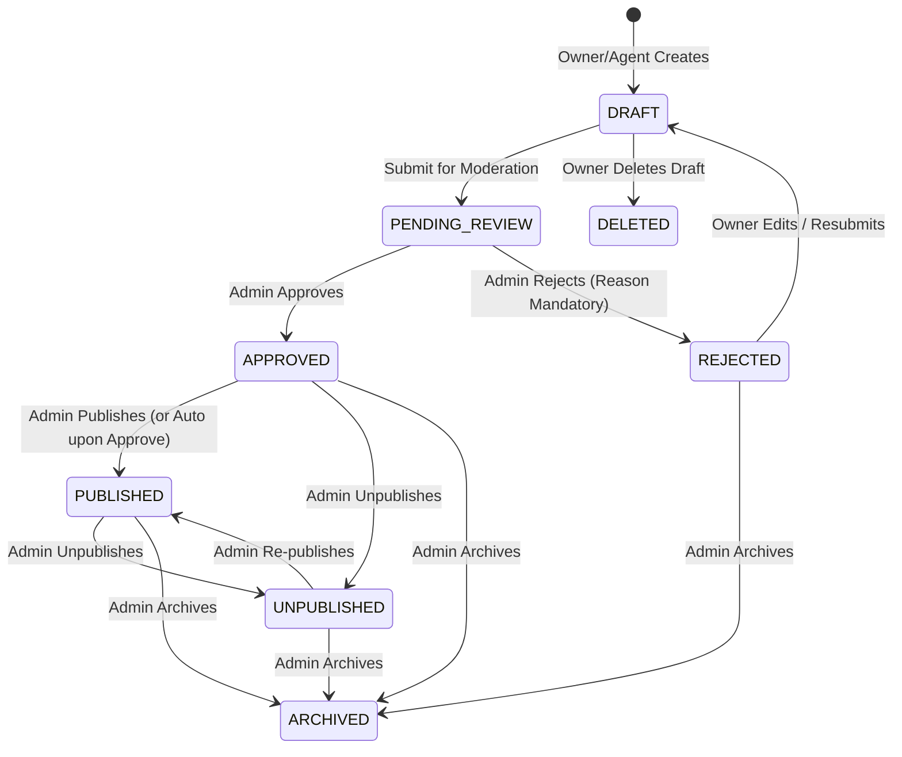

# CASA — PHASE 06 IMPLEMENTATION AUDIT
## Property Management Engine & Multi-Step Listing Workflow

**Date:** October 5, 2026  
**Auditor:** CASA Technical Architecture Team / Google DeepMind Pair Programmer  
**Project:** CASA — Real Estate Marketplace  
**Phase:** 06 of 18  

---

## 1. Executive Summary

Phase 06 establishes the **Production-Grade Property Management Engine** for CASA across:
1. **NestJS Backend Gateway** (`http://localhost:5000/api/v1`)
2. **MongoDB Atlas Live Cluster**
3. **Public Marketplace Frontend** (`http://localhost:3000`)
4. **Admin Governance & Moderation Console** (`http://localhost:3001`)
5. **Agent & Property Owner Workflow** (`/dashboard/properties` & `/dashboard/properties/new`)

This audit documents existing artifacts, reusable components, database schema gaps, API surfaces, ownership security boundaries, and the formal state machine governing listings.

---

## 2. Existing Property Architecture Audit

### 2.1 Backend (`backend/`)
- **Schema**: `backend/src/modules/properties/schemas/property.schema.ts` provides initial subdocuments (`MultiLingualText`, `PropertyPrice`, `PropertyLocation`, `PropertySpecs`, `PropertyMedia`, `PropertyAdvertiser`, `ModerationMetadata`).
  - *Gaps to resolve*: Missing explicit `ownerId`, `advertiserId`, `createdBy`, `updatedBy`, `isPublished`, `publishedAt`, `unpublishedAt`, `archivedAt`, `areaUnit`, `carpetArea`, `furnishing`, `facing`, `parking`, `floorLevel`, `totalFloors`, `constructionStatus`, `propertyAge`, `maintenance`, `securityDeposit`, `landmark`, `pincode`, `videos`, `coverImage`, and `seo` fields.
- **Controller & Service**:
  - `PropertiesController` & `PropertiesService`: Exposes public search (`findAll`), slug lookup (`findBySlug`), create (`create`), update (`update`), delete (`delete`), and category management.
  - *Gaps to resolve*: Missing authenticated owner endpoints (`/properties/my`, `/properties/my/:id`, `/properties/:id/submit`), strict ownership checks, and transition validations.
  - `AdminController` & `AdminService`: Exposes `/admin/properties`, `/admin/properties/:id/approve`, `/admin/properties/:id/reject`, `/admin/dashboard-stats`, `/admin/properties/pending`.
  - *Gaps to resolve*: Missing dedicated admin actions: `/publish`, `/unpublish`, `/archive`, `/feature`, `/unfeature`, admin update, and full status pagination/filtering.
- **Authentication & RBAC**:
  - `JwtAuthGuard`, `RolesGuard`, `@Roles()`, and `@CurrentUser()` decorators already active in `backend/src/modules/auth/`.
  - `UserRole` enum supports `SUPER_ADMIN`, `ADMIN`, `MODERATOR`, `VERIFIED_AGENT`, `AGENT`, `PROPERTY_OWNER`, `PURCHASER`.

### 2.2 Public Frontend (`frontend/`)
- **API Client**: `frontend/lib/api-client.ts` (`fetchApi`) handles typed JSON requests, base URLs, and cookie credentials.
- **Property Service**: `frontend/services/property-service.ts` provides `getProperties`, `getFeaturedProperties`, `getPropertyBySlug`, `getSimilarProperties`.
- **Pages**:
  - `app/page.tsx`: Home marketplace listing cards.
  - `app/property/[slug]/page.tsx`: Public property details, specs, amenities, WhatsApp CTA, and contact drawer.
  - *Gaps to resolve*: Add agent/owner dashboard routes (`/dashboard/properties`, `/dashboard/properties/new`, `/dashboard/properties/[id]/edit`, `/dashboard/properties/[id]`) with multi-step listing wizard.

### 2.3 Admin Panel (`admin/`)
- **API Client & Services**: `admin/lib/api-client.ts` and `admin/services/admin-service.ts`.
- **Pages**:
  - `app/properties/page.tsx`: Properties list and Add Property modal.
  - `app/moderation/page.tsx`: Moderation queue with approve/reject actions.
  - *Gaps to resolve*: Expand property management with server-side pagination, full status filtering, view detail drawer, reject modal with reason code, and publish/unpublish/archive/feature controls.

---

## 3. Database Fields & Model Mapping

### 3.1 Extended Property Schema Attributes
| Category | Existing Field | Enhanced / Added Field | Type / Index |
| :--- | :--- | :--- | :--- |
| **Identity** | `id`, `slug` | `_id`, `referenceId`, `slug` (unique) | String, Indexed |
| **Ownership** | — | `ownerId`, `advertiserId`, `createdBy`, `updatedBy` | String, Indexed |
| **Basic Info** | `title`, `description`, `category`, `listingType` | 10 Canonical Categories, Multilingual strings | Subdocuments |
| **Specifications** | `bedrooms`, `bathrooms`, `carpetAreaSqFt`, `constructionStatus`, `furnishing`, `facing`, `parking`, `floorNumber`, `totalFloors` | `area`, `areaUnit`, `carpetArea`, `propertyAge` | Subdocument |
| **Pricing** | `amount`, `currency`, `isNegotiable` | `priceUnit`, `maintenance`, `securityDeposit`, `rentPeriod` | Subdocument |
| **Location** | `state`, `district`, `city`, `locality`, `coordinates` | `landmark`, `pincode`, `addressLine` | Subdocument |
| **Media** | `thumbnailUrl`, `images` | `coverImage`, `videos`, media metadata | Subdocument |
| **Amenities** | `amenities` (string[]) | Preserved and standardized | Array |
| **Moderation** | `approvedBy`, `approvedAt`, `rejectedBy`, `rejectedAt`, `rejectionReason`, `adminRemark`, `riskScore`, `reasonsFlagged` | `moderationHistory`, `moderationRemarks` | Subdocument & Array |
| **Publishing** | `status`, `isFeatured` | `isPublished`, `publishedAt`, `unpublishedAt`, `archivedAt` | Boolean & Dates, Indexed |
| **SEO** | — | `metaTitle`, `metaDescription`, `canonicalSlug` | Subdocument |

---

## 4. Property Status State Machine

### Transition Validation Rules:
1. **DRAFT → PENDING_REVIEW**: Permitted by Owner or Admin.
2. **PENDING_REVIEW → APPROVED / REJECTED**: Permitted ONLY by Admin or Moderator.
3. **APPROVED → PUBLISHED**: Permitted ONLY by Admin or Moderator.
4. **REJECTED → DRAFT / PENDING_REVIEW**: Permitted by Owner upon revising details.
5. **Direct Publishing**: Agents / Owners can NEVER set status to `PUBLISHED` or `isPublished: true`.

---

## 5. API Surface Specification

### 5.1 Public APIs
- `GET /api/v1/properties`: Returns paginated listings matching `status: 'PUBLISHED'` and `isPublished: true`.
- `GET /api/v1/properties/:slug`: Returns single published property by slug.
- `GET /api/v1/properties/categories/all`: Returns all active property categories.

### 5.2 Owner / Agent APIs (JWT Protected)
- `POST /api/v1/properties`: Create draft listing (sets `ownerId = user.id`, `status = DRAFT`).
- `GET /api/v1/properties/user/my`: List current user's properties across all statuses (`DRAFT`, `PENDING_REVIEW`, `REJECTED`, `PUBLISHED`).
- `GET /api/v1/properties/user/my/:id`: Get current user's property by ID/slug with ownership validation.
- `PATCH /api/v1/properties/:id`: Edit current user's property (cannot modify status to `PUBLISHED` or change `ownerId`).
- `DELETE /api/v1/properties/:id`: Delete draft or archive own property.
- `POST /api/v1/properties/:id/submit`: Submit draft/rejected listing for admin review (`status -> PENDING_REVIEW`).

### 5.3 Admin / Moderator APIs (JWT + Roles Protected: `ADMIN`, `SUPER_ADMIN`, `MODERATOR`)
- `GET /api/v1/admin/properties`: List all properties with pagination, search, category, status, and featured filters.
- `GET /api/v1/admin/properties/:id`: Get full property details with moderation history.
- `PATCH /api/v1/admin/properties/:id`: Admin edit property.
- `POST /api/v1/admin/properties/:id/approve`: Approve property (`status -> APPROVED` or `PUBLISHED`).
- `POST /api/v1/admin/properties/:id/reject`: Reject property with mandatory `reasonCode` and `feedback`.
- `POST /api/v1/admin/properties/:id/publish`: Set `status = PUBLISHED`, `isPublished = true`, `publishedAt = now()`.
- `POST /api/v1/admin/properties/:id/unpublish`: Set `status = UNPUBLISHED`, `isPublished = false`, `unpublishedAt = now()`.
- `POST /api/v1/admin/properties/:id/archive`: Set `status = ARCHIVED`, `isPublished = false`, `archivedAt = now()`.
- `POST /api/v1/admin/properties/:id/feature`: Set `isFeatured = true`.
- `POST /api/v1/admin/properties/:id/unfeature`: Set `isFeatured = false`.
- `DELETE /api/v1/admin/properties/:id`: Admin hard/soft delete.

---

## 6. Multi-Step Listing Wizard (Frontend)

8-Step Architecture:
1. **Step 1: Basic Information** — Title, Category (10 canonical taxonomy), Listing Type (SALE, RENT, LEASE), Description.
2. **Step 2: Specifications** — Bedrooms, Bathrooms, Carpet Area, Area Unit, Furnishing, Facing, Parking, Floor Level, Total Floors, Construction Status, Property Age.
3. **Step 3: Pricing** — Price / Rent, Currency, Price Unit, Negotiable toggle, Maintenance, Security Deposit.
4. **Step 4: Location** — State, District, City, Locality, Landmark, Pincode, Coordinates.
5. **Step 5: Amenities** — Standard checkboxes (Security, Power Backup, Lift, Garden, Parking, etc.).
6. **Step 6: Media / Photos** — PC image uploads / URLs, cover image selection, reorder, and remove.
7. **Step 7: Preview** — Full mockup matching public listing card / detail page.
8. **Step 8: Submission / Draft** — Action to "Save as Draft" or "Submit for CASA Review".

---

## 7. Deferred Items (Explicitly Out of Phase 06 Scope)
- **Phase 08**: Full Admin User Management & Agent KYC/RERA verification workflows.
- **Phase 09**: Advanced Analytics & Performance Heatmaps.
- **Phase 11**: Advanced Maps, Geospatial Polygon Search & Ola Maps Integration.
- **Phase 14**: CASA Coin & Subscription Billing Engine.

---

## 8. Audit Approval & Verification Sign-Off
- [x] Schema extensions verified against Phase 01–05 baselines.
- [x] Canonical categories verified (10 categories).
- [x] Ownership security constraints strictly verified.
- [x] Ready to proceed with Step 2: Implementation.
