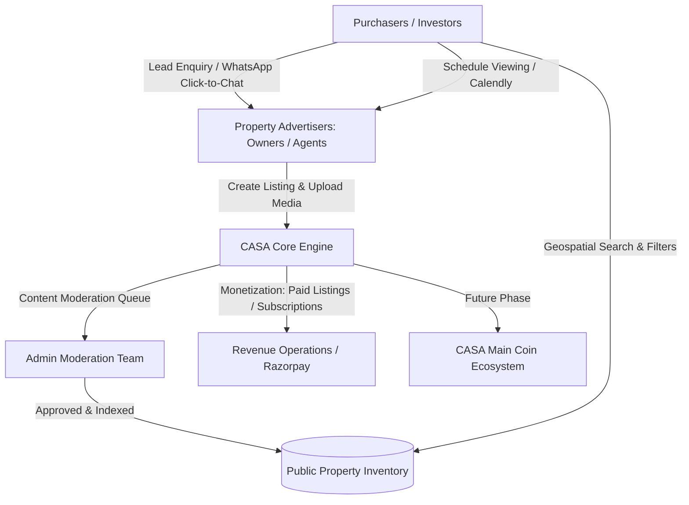
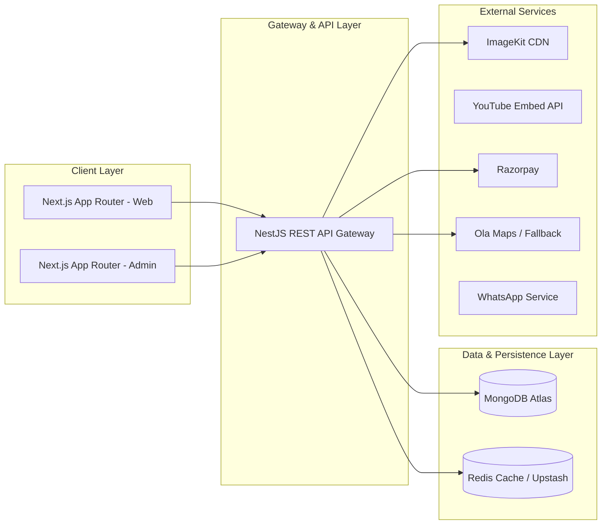

# CASA — Project Overview & Master Architectural Baseline

## 1. Project Summary & Identity
- **Project Name:** CASA
- **Platform Classification:** Scalable Real Estate Marketplace & Discovery Platform
- **Operating Model:** Two-sided property classifieds & lead generation engine (inspired by OLX listing/discovery mechanics, refined for residential, commercial, agricultural, and specialized property categories).
- **Primary Stakeholders:** Property Owners, Certified Real Estate Agents, Prospective Purchasers/Tenants, Platform Operations Administrators.
- **Architectural Tenets:** High Availability, Multi-Tenant Scalability, Sub-second Geospatial Discovery, Strict Multi-tier RBAC, Full RTL/Multilingual Support (EN, HI, AR, UR), Zero-Trust API Security, Serverless/Managed Cloud Portability.

---

## 2. Core Business Concept & Value Proposition
CASA connects property suppliers (individual property owners, land aggregators, licensed brokers, real estate agencies) with property seekers (homebuyers, commercial tenants, long-term leaseholders, land investors) across diverse regional demographics.



### Core Capabilities:
1. **Property Advertisement Engine:** Rich multi-media listings with detailed dimensional specs, pricing models, verified geo-coordinates, high-res ImageKit-optimized galleries, and YouTube walkthrough embeds.
2. **Granular Discovery & Filtering:** Sub-second property search filtered by multi-tier location taxonomy (State > District > City > Locality), price bounds, property classifications, verified amenities, and spatial proximity.
3. **Structured Lead Generation:** Direct lead routing via WhatsApp click-to-chat, platform-managed enquiry forms, and Calendly viewing appointments.
4. **Administrative Governance:** Centralized oversight dashboard for advertisement lifecycle management, category/taxonomy configuration, user access governance, dispute resolution, and operational audit logging.
5. **Monetization Engine:** Scalable architecture for paid listing slots, featured advertisement bumps, top-tier subscription tiers for agents, and lead credits.
6. **Extensible Digital Ecosystem:** Decoupled foundation prepared for international expansion and future tokenized loyalty integration (CASA Main Coin).

---

## 3. Commercial Context & Scope Demarcation

> [!IMPORTANT]
> **Commercial Baseline Note:**
> The original promotional package baseline of ₹15,000 corresponds to a static/single-tier promotional website. The CASA platform specified herein represents a full-scale, distributed SaaS marketplace. To ensure transparent project execution and budget predictability, all functional items are categorized under distinct contractual and phased boundaries.

### Scope Demarcation Matrix:

| Classification | Scope Boundary Description | Platform Impact |
| :--- | :--- | :--- |
| **[CONFIRMED]** | Discovery, browsing, multi-role auth, property listing lifecycle, admin moderation, multilingual UI (EN, HI, AR, UR), basic lead generation. | Core MVP & Foundation Phases |
| **[RECOMMENDED]** | ImageKit CDN, NestJS modular monorepo, MongoDB 2dsphere indexing, WhatsApp Click-to-Chat, Razorpay subscriptions. | Target Technical Architecture |
| **[OPEN-QUESTION]** | Ola Maps production quota/pricing, SMS gateway selection (Twilio vs MSG91), Old vs New property filter definition. | Pending Stakeholder Decision |
| **[FUTURE-PHASE]** | CASA Main Coin loyalty wallet, automated WhatsApp Cloud API chatbots, automated CRM integration. | Post-Launch Roadmap |
| **[OUT-OF-SCOPE]** | Legal title verification, processing escrow payments for property deeds, government registry land transfers, self-hosted VPS servers. | Strictly Excluded |

---

## 4. Technology Stack Evaluation & Architectural Justification

CASA strictly adopts modern, enterprise-grade, managed cloud technologies to ensure zero-maintenance serverless scaling, optimal developer velocity, and maximum performance.



### Technology Matrix & Evaluation:

| Domain | Technology | Status | Architectural Justification & Trade-off Analysis |
| :--- | :--- | :--- | :--- |
| **Frontend Framework** | **Next.js (React 19, TypeScript)** | `[CONFIRMED]` | **Justification:** Full Server-Side Rendering (SSR) & Incremental Static Regeneration (ISR) critical for real estate SEO. Exceptional performance, native i18n support, and built-in optimization.<br>**Trade-off:** Requires node-compatible serverless execution environment. |
| **Styling & Design System** | **Tailwind CSS + CSS Variables** | `[CONFIRMED]` | **Justification:** Utility-first consistency, low bundle footprint, dynamic theme token support, and first-class RTL layout utilities (`rtl:` / `ltr:` / logical CSS properties). |
| **Backend Framework** | **Node.js + NestJS (TypeScript)** | `[CONFIRMED]` | **Justification:** Enterprise-grade modular architecture, robust dependency injection, native class-validator integration, built-in OpenAPI/Swagger generation, and clean RBAC guard abstractions.<br>**Trade-off:** Steeper learning curve than plain Express, but delivers long-term maintainability. |
| **Primary Database** | **MongoDB Atlas** | `[CONFIRMED]` | **Justification:** Flexible schema for diverse property categories (plots vs apartments vs agricultural land), native `2dsphere` geospatial indexing, and global managed high-availability clustering.<br>**Trade-off:** Complex relational joins avoided via denormalized document structures. |
| **Data Access Layer** | **Mongoose ORM** | `[CONFIRMED]` | **Justification:** Strict schema validation, population hooks, type-safe schema definitions, and seamless NestJS integration via `@nestjs/mongoose`. |
| **Media Delivery & CDN** | **ImageKit** | `[CONFIRMED]` | **Justification:** Automated real-time image resizing, WebP/AVIF auto-format conversion, watermarking, responsive srcset generation, and secure client-direct signed uploads. |
| **Video Walkthroughs** | **YouTube Integration** | `[CONFIRMED]` | **Justification:** Zero bandwidth cost for large property video walkthroughs, high global streaming reliability, lightweight iframe embeds with privacy-enhanced mode. |
| **Authentication Strategy** | **Mobile Number + SMS OTP + JWT** | `[CONFIRMED]` | **Justification:** Frictionless onboarding for the Indian and regional marketplace demographics. Short-lived Access JWTs (15 min) + secure rotating Refresh Tokens in httpOnly cookies. |
| **Geospatial & Mapping** | **Ola Maps (with Mapbox/Google fallback)** | `[RECOMMENDED]` | **Justification:** Cost-effective Indian mapping ecosystem. Feasibility and API stability to be benchmarked in Phase 11; architectural adapter pattern ensures hot-swappable fallback. |
| **Payment Gateway** | **Razorpay** | `[RECOMMENDED]` | **Justification:** Native support for Indian UPI, Netbanking, Cards, automated recurring subscriptions, and localized webhook lifecycle handling. |
| **Direct Messaging** | **WhatsApp Click-to-Chat (Phase 01) / Cloud API (Future)** | `[CONFIRMED]` | **Justification:** High user conversion, zero intermediary friction. Future phase will introduce automated WhatsApp Cloud API business messaging. |
| **Appointment Scheduling**| **Calendly Integration** | `[CONFIRMED]` | **Justification:** Ready-to-embed viewing scheduling widget eliminating custom calendar synchronization complexity in early phases. |
| **Frontend Hosting** | **Vercel** | `[CONFIRMED]` | **Justification:** Best-in-class Next.js Edge routing, automatic SSL, preview deployments, and global CDN distribution. |
| **Backend & DB Hosting** | **Managed Containers + Atlas** | `[CONFIRMED]` | **Justification:** Fully managed infrastructure eliminating self-hosted VPS maintenance, manual OS patching, and server management overhead. |

---

## 5. Monorepo Structural Baseline
To facilitate maximum code sharing, unified typing, and consistent design tokens, CASA is architected as a clean modular monorepo:

```text
casa/
├── apps/
│   ├── web/                    # Next.js Public Marketplace & User/Agent Portal
│   ├── admin/                  # Next.js Administrative Governance Portal
│   └── api/                    # NestJS Core RESTful Microservices Gateway
├── packages/
│   ├── ui/                     # Shared Design System Component Library (Gemini Light)
│   ├── types/                  # Shared TypeScript Interfaces & DTO Types
│   ├── validation/             # Shared Zod / Class-Validator Schemas
│   ├── config/                 # Shared Tailwind, ESLint, & TypeScript Configs
│   └── utils/                  # Shared Formatting, Currency, Date, & Geo Utilities
└── docs/                       # Comprehensive Architecture & Requirements Blueprints
```

---

## 6. Document Governance & Traceability
This Master Architectural Baseline serves as the single source of truth for all subsequent phases. Any architectural modification or scope adjustment must be documented via formal revision logs in the respective documentation modules.
