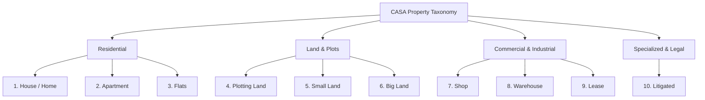
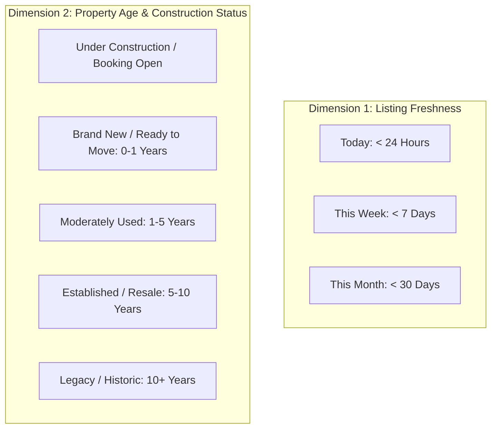
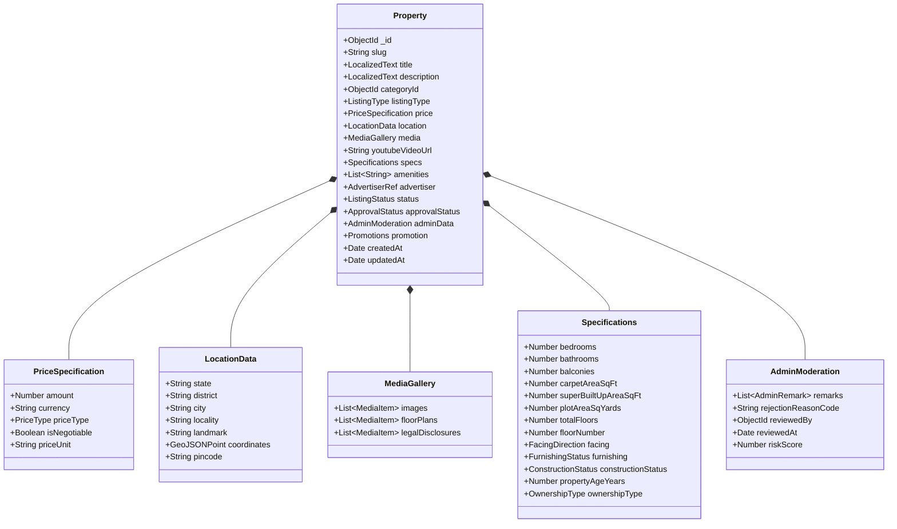

# CASA — Property Data Model & Taxonomy Specification

## 1. Category Taxonomy Blueprint

CASA organizes real estate advertisements across 10 foundational categories, engineered with dynamic schema extensibility to allow administrative configuration without code modifications.



### Detailed Initial Categories:
1. **House / Home (`HOUSE_HOME`):** Independent villas, individual residential bungalows, duplexes, row houses, and standalone residential buildings.
2. **Apartment (`APARTMENT`):** Premium high-rise apartments, gated society condominiums, and multi-tower residential developments.
3. **Flats (`FLATS`):** Standalone residential builder floors, studio units, budget multistorey flats, and regional residential apartments.
4. **Plotting Land (`PLOTTING_LAND`):** Subdivided approved residential/commercial layouts, gated plot townships, and plotted development schemes.
5. **Small Land (`SMALL_LAND`):** Compact rural or peri-urban land parcels (e.g., < 1 acre, measured in bigha, katha, biswa, or sq. yards) suitable for small-scale projects.
6. **Big Land (`BIG_LAND`):** Large agricultural acreage, industrial land banks, institutional parcels, and commercial farm zones (> 1 acre).
7. **Shop (`SHOP`):** Retail storefronts, commercial showroom spaces, shopping complex booths, and high-street commercial shops.
8. **Warehouse (`WAREHOUSE`):** Logistics storage hubs, godowns, industrial sheds, cold storage facilities, and fulfillment depots.
9. **Lease (`LEASE`):** Long-term commercial or industrial lease agreements, institutional rental properties, and commercial land leases.
10. **Litigated (`LITIGATED`):** Properties with disclosed legal disputes, bank auction properties (SARFAESI), disputed co-ownership, or distressed asset recovery situations requiring explicit legal disclaimers.

---

## 2. Dynamic & Configurable Category Architecture

Categories are stored in a dedicated `categories` collection, allowing authorized administrators to configure metadata schemas dynamically:

```json
{
  "_id": "66f1a8c9e01234567890abcd",
  "slug": "house-home",
  "name": {
    "en": "House / Home",
    "hi": "घर / मकान",
    "ar": "منزل / بيت",
    "ur": "گھر / مکان"
  },
  "icon": "home-icon",
  "group": "RESIDENTIAL",
  "isActive": true,
  "sortOrder": 1,
  "requiredAttributes": ["bedrooms", "bathrooms", "builtUpAreaSqFt", "furnishingStatus"],
  "allowedListingTypes": ["SALE", "RENT", "LEASE"],
  "createdAt": "2026-10-01T10:00:00.000Z"
}
```

---

## 3. Disambiguation of the "Old / New" Filter Ambiguity

> [!WARNING]
> **Architectural Ambiguity Resolution: "Old" vs. "New" Filter**
> In real estate discovery, "Old vs. New" is frequently ambiguous. It can refer to:
> 1. **Listing Freshness:** Date the advertisement was published on CASA (e.g., "New Listing" = < 7 days).
> 2. **Construction Status & Age:** Physical age of the structure (e.g., "Brand New / Under Construction" vs. "Pre-owned / Resale / 10+ Years Old").
>
> CASA resolves this by **strictly separating** these into two independent, queryable dimensions in the data model and UI:



### Data Fields Supporting Disambiguation:
- `createdAt` (Timestamp): Automated listing timestamp for Freshness filtering (`freshnessFilter`).
- `constructionStatus`: Enum (`UNDER_CONSTRUCTION`, `READY_TO_MOVE`, `RESALE`, `DISTRESSED`).
- `propertyAgeYears`: Numeric (Integer representing structure age).

---

## 4. Property Entity Schema Blueprint



---

## 5. Comprehensive Field Specification Table

| Field Path | Type | Nullable | Required | Indexing | Purpose & Description |
| :--- | :--- | :---: | :---: | :---: | :--- |
| `_id` | `ObjectId` | No | Auto | Primary | Unique document identifier. |
| `slug` | `String` | No | Yes | Unique | SEO-friendly URL slug (e.g., `3-bhk-luxury-flat-gomti-nagar-lucknow-10293`). |
| `title` | `Object (Localized)` | No | Yes | Text Search | Multi-language title string (`en`, `hi`, `ar`, `ur`). |
| `description` | `Object (Localized)` | No | Yes | Text Search | Full markdown-supported property description. |
| `categoryId` | `ObjectId` | No | Yes | Compound | Foreign reference to `categories` collection. |
| `listingType` | `Enum` | No | Yes | Compound | `SALE`, `RENT`, `LEASE`. |
| `price.amount` | `Number` | No | Yes | Compound | Numerical price value in primary regional currency (INR / SAR). |
| `price.currency` | `String` | No | Yes | None | Standard ISO currency code (`INR`, `SAR`, `AED`, `USD`). |
| `price.priceType` | `Enum` | No | Yes | None | `TOTAL_PRICE`, `PER_SQ_FT`, `PER_SQ_YARD`, `PER_MONTH`, `PER_YEAR`. |
| `price.isNegotiable` | `Boolean` | No | Yes | None | Flag indicating price negotiability. |
| `location.state` | `String` | No | Yes | Compound | State / Province name. |
| `location.district` | `String` | No | Yes | Compound | District / County name. |
| `location.city` | `String` | No | Yes | Compound | City / Municipality name. |
| `location.locality` | `String` | No | Yes | Compound | Neighborhood / Locality name. |
| `location.coordinates` | `GeoJSON Point` | No | Yes | `2dsphere` | Geospatial point `[longitude, latitude]` for radial search. |
| `media.images` | `Array<MediaItem>` | No | Yes (Min 1) | None | Array of ImageKit CDN assets (URLs, thumbnails, dimensions). |
| `youtubeVideoUrl` | `String` | Yes | No | None | Validated YouTube video URL or ID for walkthrough embed. |
| `specs.carpetAreaSqFt` | `Number` | Yes | Conditional | Range Index | Usable carpet area in square feet. |
| `specs.plotAreaSqYards` | `Number` | Yes | Conditional | Range Index | Total plot area in square yards (for lands/plots). |
| `specs.constructionStatus` | `Enum` | No | Yes | Compound | `UNDER_CONSTRUCTION`, `READY_TO_MOVE`, `RESALE`. |
| `specs.propertyAgeYears` | `Number` | Yes | No | None | Physical structural age of property. |
| `advertiser.userId` | `ObjectId` | No | Yes | Compound | Foreign reference to `users` collection. |
| `advertiser.role` | `Enum` | No | Yes | None | Role at creation (`OWNER`, `AGENT`, `VERIFIED_AGENT`). |
| `approvalStatus` | `Enum` | No | Yes | Compound | `PENDING`, `APPROVED`, `REJECTED`, `CHANGES_REQUESTED`. |
| `status` | `Enum` | No | Yes | Compound | `DRAFT`, `ACTIVE`, `EXPIRED`, `SOLD_OR_RENTED`, `SUSPENDED`. |
| `promotion.isFeatured` | `Boolean` | No | Yes | Compound | Boolean flag for top-tier placement. |
| `promotion.featuredExpiresAt` | `Date` | Yes | No | TTL / Comp | Expiration timestamp for featured promotion boost. |
| `adminData.remarks` | `Array<Remark>` | Yes | No | None | **Admin Only:** Internal moderation comments and audit notes. |
| `adminData.rejectionReason` | `String` | Yes | No | None | **Admin Only:** Code identifying rejection justification. |
| `createdAt` | `Date` | No | Auto | Compound | Listing creation timestamp for freshness sorting. |
| `updatedAt` | `Date` | No | Auto | None | Last modification timestamp. |

---

## 6. Category-Specific Schema Rules

1. **Residential (`HOUSE_HOME`, `APARTMENT`, `FLATS`):**
   - Mandatory: `bedrooms`, `bathrooms`, `furnishingStatus`, `carpetAreaSqFt`.
   - Optional: `floorNumber`, `totalFloors`, `balconies`, `facingDirection`, `parkingSlots`.
2. **Land & Plots (`PLOTTING_LAND`, `SMALL_LAND`, `BIG_LAND`):**
   - Mandatory: `plotAreaSqYards` or `acreage`, `boundaryFencing` (Boolean), `roadWidthFt`.
   - Excluded: `bedrooms`, `bathrooms`, `furnishingStatus`.
3. **Commercial (`SHOP`, `WAREHOUSE`):**
   - Mandatory: `carpetAreaSqFt`, `powerBackupCapacity`, `loadingDocks` (for Warehouse).
4. **Specialized (`LITIGATED`):**
   - Mandatory: `litigationType` (`BANK_AUCTION`, `DISPUTED_TITLE`, `COURT_CASE`), `courtCaseSummary`, `legalDisclaimerAcknowledged` (Boolean).
