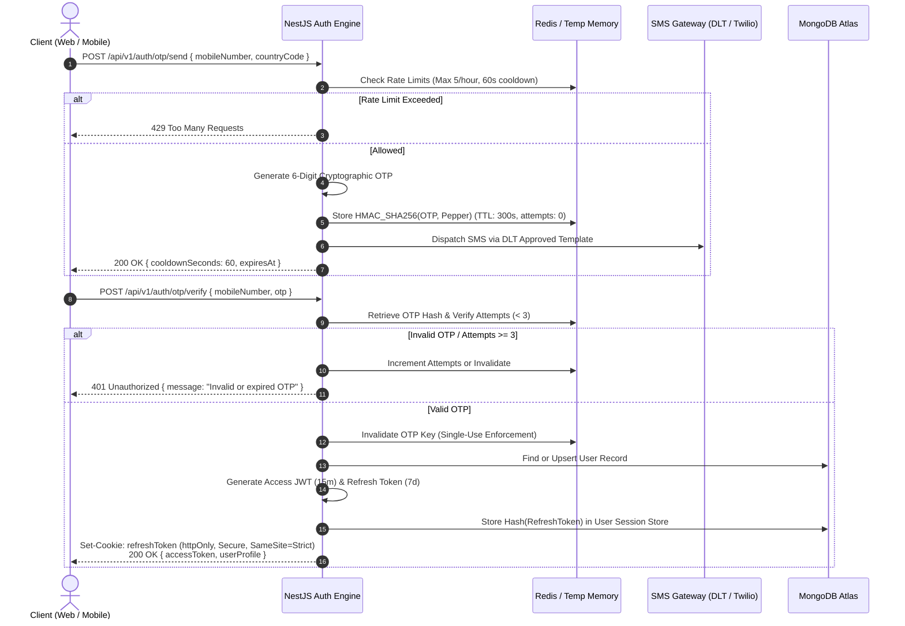
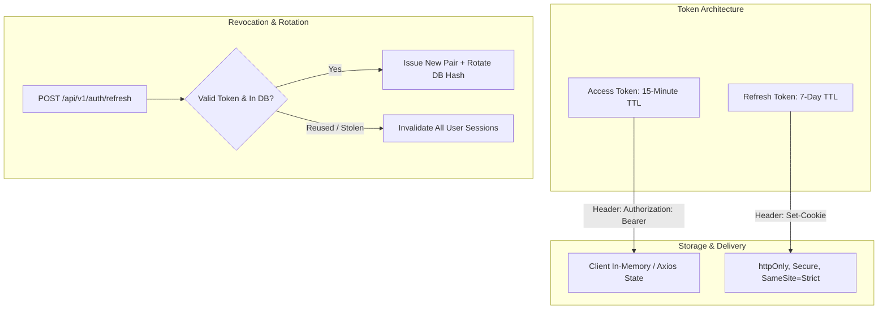

# CASA — Security & Authentication Architecture

## 1. Authentication Flow: Mobile OTP & Session Architecture

CASA uses mobile OTP authentication as its primary identity mechanism, combined with short-lived JSON Web Tokens (JWT) and rotating Refresh Tokens stored in secure browser cookies.



---

## 2. Cryptographic Security & OTP Storage

> [!CAUTION]
> **Zero Plaintext Storage Policy**
> Under no circumstances may plain-text OTPs, API keys, or session tokens be persisted to permanent databases or unencrypted memory stores.

### OTP Cryptographic Standards:
1. **RNG Generation:** OTPs are generated using `crypto.randomInt(100000, 999999)` to prevent pseudo-random prediction attacks.
2. **Key Storage:** Stored in Redis under the key `auth:otp:<e164_phone_number>` as an HMAC-SHA256 hash using a server-side environment secret (`OTP_HASH_SECRET`).
3. **Time-To-Live (TTL):** Hard expiry at 300 seconds (5 minutes). Redis automated TTL ensures immediate eviction.
4. **Max Verification Attempts:** A maximum of 3 failed attempts is permitted. On the 3rd failed attempt, the OTP is destroyed, and the number is locked for 15 minutes.

---

## 3. Token Strategy: Short-Lived Access JWT + Rotating Refresh Cookie



### Token Payload Specifications:
- **Access JWT Claims:**
  - `sub`: User ObjectId
  - `role`: User Role (`SUPER_ADMIN`, `ADMIN`, `AGENT`, `PURCHASER`)
  - `phone`: Masked mobile number
  - `exp`: 15 minutes from issue
  - `iss`: `casa-auth-service`

---

## 4. API Security, Rate Limiting & Abuse Prevention

### 4.1 Tiered Rate Limiting Matrix
Enforced using NestJS Throttler with Redis backing:

| Endpoint Route Type | Target Scope | Limit Threshold | Action on Breach |
| :--- | :--- | :--- | :--- |
| `/api/v1/auth/otp/send` | Phone Number + IP | 5 requests / 60 mins | 429 Too Many Requests (1-hour cooldown) |
| `/api/v1/auth/otp/verify` | Phone Number + IP | 3 attempts / 5 mins | 429 Too Many Requests (15-min lockout) |
| `/api/v1/properties` (Search) | Client IP Address | 120 requests / minute | 429 Rate Limit (Backoff required) |
| `/api/v1/enquiries` (Submit) | Authenticated User | 10 submissions / hour | Anti-spam CAPTCHA challenge |
| `/api/v1/admin/*` | Authenticated Admin | 300 requests / minute | Security alert trigger |

---

### 4.2 Web Application Firewall (WAF) & Input Sanitization
1. **Zod / Class-Validator Strict Parsing:** All incoming payloads are validated against strict DTO definitions with `whitelist: true, forbidNonWhitelisted: true`. Unknown fields are discarded.
2. **NoSQL Injection Prevention:** Mongoose sanitization filters out `$where`, `$gt`, and operator-injection payloads from query strings.
3. **Cross-Site Scripting (XSS):** All rich-text descriptions are sanitized using DOMPurify before markdown rendering.
4. **CORS Configuration:** Explicit origin whitelisting (`ALLOWED_ORIGINS=https://casa.com,https://admin.casa.com`). Wildcard `*` is forbidden on authenticated endpoints.

---

## 5. Media Upload Security (ImageKit Integration)

1. **Client-Direct Signed Uploads:** Client applications never upload heavy image files through the core NestJS API. Instead, the backend generates short-lived cryptographic upload parameters (HMAC signature, timestamp, token).
2. **MIME-Type & Magic Byte Validation:** ImageKit webhook validates real file magic bytes to block disguised executables (accepting only `image/jpeg`, `image/png`, `image/webp`).
3. **Payload Boundaries:** Single image uploads capped at 10 MB; maximum 15 images per property listing.
4. **Watermarking:** Automatically stamps CASA branding on public listing images to deter unauthorized cross-platform scraping.

---

## 6. Immutable Security Audit Logging

All privileged operations executed by administrative, moderation, or agent accounts trigger an immutable audit event stored in the `auditLogs` collection:

```json
{
  "_id": "66f1b0a1c1234567890def12",
  "actorId": "66f1a8c9e01234567890abcd",
  "actorRole": "MODERATOR",
  "action": "LISTING_REJECTED",
  "targetCollection": "properties",
  "targetDocumentId": "66f19999e01234567890ffff",
  "details": {
    "rejectionReasonCode": "SUSPICIOUS_PRICE_DISCREPANCY",
    "internalRemarks": "Reported price ₹ 5 Lac for 3BHK in prime area appears fraudulent."
  },
  "ipAddress": "203.0.113.42",
  "userAgent": "Mozilla/5.0 ... Chrome/128.0",
  "timestamp": "2026-10-01T10:15:30.000Z"
}
```

Audit records are append-only. No API endpoint or administrative interface allows editing or deleting audit log documents.
