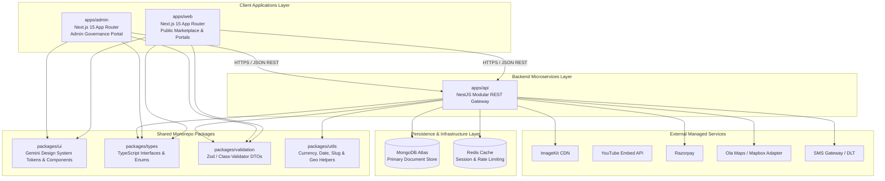
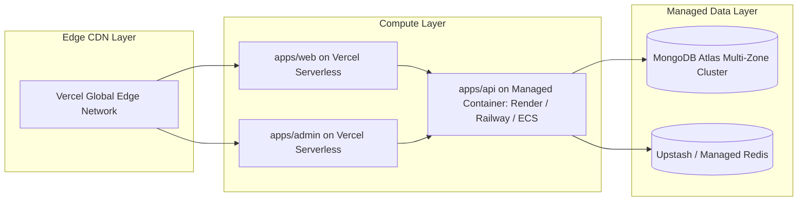

# CASA — Technical Architecture & Monorepo Blueprint

## 1. High-Level System Architecture

CASA adopts a modular monorepo architecture separating frontend consumer applications, administrative governance portals, and backend RESTful microservices while sharing common validation schemas, types, and UI design tokens.



---

## 2. Monorepo Structural Blueprint

The monorepo structure is organized using npm/pnpm workspaces or Turborepo:

```text
casa/
├── apps/
│   ├── web/                     # Next.js Public Marketplace, Agent Portal & User Dashboard
│   │   ├── src/
│   │   │   ├── app/             # App Router with localized segments [lang]/...
│   │   │   ├── components/      # Web-specific presentation components
│   │   │   ├── hooks/           # Custom React query & mutation hooks
│   │   │   └── lib/             # API client instances & utilities
│   │   ├── public/              # Static assets, icons, manifest
│   │   ├── next.config.ts       # Next.js configuration & image domains
│   │   └── package.json
│   │
│   ├── admin/                   # Next.js Administrative Governance Portal
│   │   ├── src/
│   │   │   ├── app/             # Admin Router: Dashboard, Review Queue, Taxonomy, Logs
│   │   │   ├── components/      # Admin data grids, moderation side-by-side viewer
│   │   │   └── lib/             # Admin API client with RBAC interceptors
│   │   ├── package.json
│   │   └── tsconfig.json
│   │
│   └── api/                     # NestJS Core Modular RESTful Backend
│       ├── src/
│       │   ├── modules/         # Domain Modules (auth, properties, users, etc.)
│       │   ├── common/          # Global guards, filters, interceptors, decorators
│       │   ├── config/          # Environment configuration & validation
│       │   ├── app.module.ts    # Root application module
│       │   └── main.ts          # Bootstrap entry point with Swagger OpenAPI
│       ├── test/                # Unit and E2E test suites
│       ├── package.json
│       └── tsconfig.json
│
├── packages/
│   ├── ui/                      # Shared Tailwind-based UI components (Gemini Light)
│   │   ├── src/                 # Buttons, Modals, Inputs, Badges, Cards, Carousels
│   │   └── package.json
│   │
│   ├── types/                   # Shared TypeScript models, enums & interfaces
│   │   ├── src/                 # User, Property, Category, Location, Billing types
│   │   └── package.json
│   │
│   ├── validation/              # Shared Zod / Class-Validator schemas
│   │   ├── src/                 # Property DTOs, Auth schemas, Enquiry schemas
│   │   └── package.json
│   │
│   ├── config/                  # Shared ESLint, Tailwind & Prettier presets
│   └── utils/                   # Shared currency formatting, slugify, geo calculations
│
├── docs/                        # Complete Phase 01 Architecture Blueprints
├── package.json                 # Monorepo root workspace config
├── turbo.json                   # Build pipeline orchestration
└── README.md
```

---

## 3. Backend Modular Architecture (NestJS)

The backend (`apps/api`) encapsulates business logic into strictly decoupled NestJS modules:

```mermaid
graph TD
    AppModule[AppModule]
    
    AppModule --> AuthModule[1. AuthModule]
    AppModule --> UsersModule[2. UsersModule]
    AppModule --> AgentsModule[3. AgentsModule]
    AppModule --> PropertiesModule[4. PropertiesModule]
    AppModule --> CategoriesModule[5. CategoriesModule]
    AppModule --> LocationsModule[6. LocationsModule]
    AppModule --> EnquiriesModule[7. EnquiriesModule]
    AppModule --> BillingModule[8. BillingModule]
    AppModule --> MediaModule[9. MediaModule]
    AppModule --> NotificationsModule[10. NotificationsModule]
    AppModule --> TranslationsModule[11. TranslationsModule]
    AppModule --> AdminModule[12. AdminModule]
```



### Module Responsibilities:
1. **`AuthModule`:** Mobile OTP lifecycle, SMS provider routing, JWT issue/refresh, Redis blacklist.
2. **`UsersModule`:** User profile management, role verification, favorite property bookmarks.
3. **`AgentsModule`:** Agent business profiles, agency badge applications, Calendly integrations.
4. **`PropertiesModule`:** Property CRUD, category attribute adaptation, draft-to-approval state machine.
5. **`CategoriesModule`:** Dynamic category taxonomy, custom attribute rules, multi-language names.
6. **`LocationsModule`:** State/District/City hierarchical tree, coordinates validation, autocomplete.
7. **`EnquiriesModule`:** Buyer lead creation, rate limiting, WhatsApp click telemetry, lead status.
8. **`BillingModule`:** Razorpay orders, subscription tier management, featured boost expiries, webhook handler.
9. **`MediaModule`:** ImageKit authentication token generation, secure asset deletion hooks.
10. **`NotificationsModule`:** Multi-channel alert dispatch (In-App notifications, SMS alerts).
11. **`TranslationsModule`:** Dynamic localization dictionary management and translation fallbacks.
12. **`AdminModule`:** Moderation queue processing, private admin remarks, immutable audit logging.

---

## 4. Third-Party Integration Architecture & Evaluation

### 4.1 Mapping & Geocoding: Ola Maps with Adapter Pattern
- **Target:** **Ola Maps** (Cost-effective Indian mapping ecosystem).
- **Feasibility Assessment:** To ensure resilient production operations, an **Adapter Pattern** is implemented. The interface `IGeocodingService` decouples the application from the underlying provider. If Ola Maps encounters API throttling or regional latency, the gateway hot-swaps to **Mapbox** or **Google Maps** via environment configuration without code changes.

```typescript
export interface IGeocodingService {
  geocodeAddress(address: string): Promise<{ lat: number; lng: number }>;
  reverseGeocode(lat: number, lng: number): Promise<LocationAddressDto>;
  getPlaceSuggestions(query: string): Promise<PlaceSuggestionDto[]>;
}
```

### 4.2 Media Management: ImageKit Direct CDN Pipeline
- **Upload Flow:** Client requests signed upload parameters from `/api/v1/media/auth-params` -> Client uploads directly to ImageKit -> ImageKit returns CDN URL -> Client saves URL with listing.
- **Transformation Pipeline:** Automatic on-the-fly transformations for responsive WebP:
  - Thumbnail: `https://ik.imagekit.io/casa/prop-1.jpg?tr=w-400,h-260,fo-auto,q-80`
  - High-Res Carousel: `https://ik.imagekit.io/casa/prop-1.jpg?tr=w-1200,h-800,q-85`

### 4.3 Payments: Razorpay Subscriptions & Webhooks
- **Flow:** Agent selects tier -> Backend calls Razorpay Orders API -> Client renders Razorpay standard checkout -> Webhook `/api/v1/billing/webhook` receives `payment.captured` event -> Cryptographic signature verified -> Account quota upgraded.

### 4.4 Communication: WhatsApp Click-to-Chat & Cloud API
- **Phase 01–12 (Click-to-Chat):** Direct browser deep-link (`https://wa.me/<phone>?text=<encoded_property_message>`) generating zero recurring API costs.
- **Phase 18 (WhatsApp Cloud API):** Automated conversational lead qualification bot using Meta Graph API.

---

## 5. Deployment Topology & Managed Cloud Infrastructure

CASA is architected for zero-maintenance serverless scaling:



- **Frontend (`web`, `admin`):** Deployed on Vercel with automatic SSL, preview branching, and Edge routing.
- **Backend API (`api`):** Deployed on fully managed container infrastructure (Render, Railway, or AWS ECS Fargate) with zero manual OS or VPS maintenance.
- **Database:** MongoDB Atlas M10+ dedicated cluster with automatic daily backups and multi-region replication.
