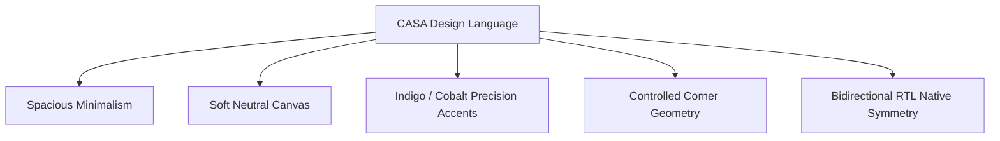

# CASA — UI/UX Design System & Information Architecture

## 1. Visual Philosophy: The Gemini-Inspired Light Aesthetic

CASA establishes a calm, spacious, and ultra-refined visual aesthetic inspired by Google Gemini and modern Scandinavian design principles. It rejects chaotic marketplace clutter, heavy neon drop-shadows, and aggressive marketing banners in favor of purposeful whitespace, crisp typography, and serene micro-interactions.



### Core Design Pillars:
1. **Clean Canvas:** Light, airy backgrounds (`#FAFAFC` / `#FFFFFF`) that allow rich architectural photography and property floor plans to stand out.
2. **Subtle Elevation:** Multi-layered diffuse shadows without harsh black outlines (`0 1px 3px rgba(0,0,0,0.05), 0 10px 25px rgba(0,0,0,0.02)`).
3. **Controlled Geometry:** Curated border radius tokens (`rounded-xl` for cards, `rounded-lg` for form inputs, `rounded-full` for badges).
4. **Restrained Motion:** Purposeful micro-transitions (150ms–250ms cubic-bezier) for hover states, modal entries, and tab switches.

---

## 2. Design Tokens & Color Palette

### 2.1 Theme Palette
```css
:root {
  /* Surface & Canvas Tokens */
  --casa-bg-canvas: #FAFAFC;
  --casa-bg-surface: #FFFFFF;
  --casa-bg-subtle: #F1F3F9;
  --casa-bg-muted: #E8ECF4;
  
  /* Border & Divider Tokens */
  --casa-border-light: #E4E7F0;
  --casa-border-medium: #D1D6E5;
  --casa-border-focus: #3B82F6;

  /* Typography Neutral Scale */
  --casa-text-primary: #0F172A;     /* Slate 900 */
  --casa-text-secondary: #475569;   /* Slate 600 */
  --casa-text-muted: #94A3B8;       /* Slate 400 */
  --casa-text-inverted: #FFFFFF;

  /* Brand & Accent Precision */
  --casa-brand-primary: #2563EB;    /* Royal Blue / Indigo 600 */
  --casa-brand-hover: #1D4ED8;      /* Indigo 700 */
  --casa-brand-subtle: #EFF6FF;    /* Indigo 50 */
  --casa-brand-accent: #6366F1;     /* Gemini Cobalt 500 */

  /* Semantic Status Tokens */
  --casa-status-success: #10B981;   /* Emerald 500 (Approved / Active) */
  --casa-status-success-bg: #ECFDF5;
  --casa-status-warning: #F59E0B;   /* Amber 500 (Pending / Expiring) */
  --casa-status-warning-bg: #FFFBEB;
  --casa-status-danger: #EF4444;    /* Crimson 500 (Rejected / Litigated) */
  --casa-status-danger-bg: #FEF2F2;
  --casa-status-info: #0EA5E9;      /* Sky 500 (Draft / Featured) */
  --casa-status-info-bg: #F0F9FF;
}
```

### 2.2 Typography Scale
- **Primary Font Family:** `Inter`, `Plus Jakarta Sans`, or `Outfit` (Clean, geometric sans-serif with high legibility across numerals and prices).
- **Arabic / Urdu Font Family:** `Noto Sans Arabic` or `Alexandria` (Balanced x-height matching Latin proportions).
- **Type Scale Hierarchy:**
  - `Display (Hero)`: 2.5rem (40px) / Line Height 1.15 / Font Weight 700
  - `H1 (Page Headers)`: 2.0rem (32px) / Line Height 1.25 / Font Weight 600
  - `H2 (Section Titles)`: 1.5rem (24px) / Line Height 1.3 / Font Weight 600
  - `H3 (Card Titles)`: 1.125rem (18px) / Line Height 1.4 / Font Weight 600
  - `Body Standard`: 1.0rem (16px) / Line Height 1.5 / Font Weight 400
  - `Body Small / Metadata`: 0.875rem (14px) / Line Height 1.4 / Font Weight 400
  - `Caption / Badge`: 0.75rem (12px) / Line Height 1.3 / Font Weight 500

---

## 3. Bidirectional (RTL) Layout Architecture

> [!IMPORTANT]
> **Complete RTL Implementation Requirement**
> Supporting Arabic (`ar`) and Urdu (`ur`) requires structural layout mirroring across every component. RTL in CASA is not merely `text-align: right` — it mirrors the entire spatial hierarchy.

```mermaid
graph LR
    subgraph LTR Layout (English & Hindi)
        L_Nav[Logo -> Search -> Nav Links -> Auth Button]
        L_Grid[Card Media [Left] | Content & Price [Right]]
        L_Form[Label: Left | Input Text: Left-to-Right]
    end
    
    subgraph RTL Layout (Arabic & Urdu)
        R_Nav[Auth Button <- Nav Links <- Search <- Logo]
        R_Grid[Content & Price [Left] | Card Media [Right]]
        R_Form[Label: Right | Input Text: Right-to-Left]
    end
```

### RTL Rules & Guidelines:
1. **Logical CSS Properties:** Use `start` and `end` exclusively (`ms-4`, `me-4`, `ps-3`, `pe-3`, `text-start`, `text-end`) instead of rigid `left`/`right` coordinates.
2. **Icon Reversal:** Directional indicators (breadcrumbs `ChevronRight`, pagination arrows, carousel next/prev, back buttons) must invert 180° in RTL mode (`transform: scaleX(-1)`).
3. **Sticky Sidebar & Drawer Inversion:** Mobile navigation drawers slide from the right in LTR, and from the left in RTL.
4. **Media Galleries:** Main image gallery thumbnails flow right-to-left in Arabic/Urdu viewports.

---

## 4. Admin Panel Information Architecture (IA)

The Administrative Governance Portal uses a non-colliding, hierarchical layout:

```mermaid
graph TD
    Admin[CASA Admin Governance IA]
    
    Admin --> M1[1. OVERVIEW]
    M1 --> M1_1[Dashboard: Metrics, Revenue, Velocity, Flagged Ads]
    
    Admin --> M2[2. PROPERTY MANAGEMENT]
    M2 --> M2_1[All Properties: Master Search & Filter]
    M2 --> M2_2[Pending Approvals: Side-by-side Review Queue]
    M2 --> M2_3[Categories: Dynamic Taxonomy & Attribute Schemas]
    M2 --> M2_4[Locations: State / District / City Tree]
    
    Admin --> M3[3. USER MANAGEMENT]
    M3 --> M3_1[All Users: Global Identity Ledger]
    M3 --> M3_2[Agents: RERA Verification & Badging Review]
    M3 --> M3_3[Purchasers: Seeker Profiles & Activity]
    
    Admin --> M4[4. BUSINESS MANAGEMENT]
    M4 --> M4_1[Enquiries & Leads: Global Inflow Monitor]
    M4 --> M4_2[Subscriptions: Active Broker Tiers]
    M4 --> M4_3[Payments: Razorpay Webhook Logs & Invoices]
    M4 --> M4_4[Offers & Bumps: Featured Listing Allocations]
    
    Admin --> M5[5. CONTENT MANAGEMENT]
    M5 --> M5_1[Homepage: Hero Banners & Curated Showcases]
    M5 --> M5_2[Pages: Terms, Privacy, FAQs, Legal Disclaimers]
    M5 --> M5_3[Media Library: Orphan Asset Cleanup & Storage]
    M5 --> M5_4[Languages: Localization String Overrides]
    
    Admin --> M6[6. SYSTEM & AUDIT]
    M6 --> M6_1[Notifications: System Broadcast Dispatcher]
    M6 --> M6_2[Settings: API Keys, Quotas, Rate Limits]
    M6 --> M6_3[Audit Logs: Immutable Administrative History]
```



---

## 5. Portal Layout Specifications

### 5.1 Public Marketplace Layout (`apps/web`)
- **Header:** Sticky glassmorphism bar (`backdrop-blur-md bg-white/90`) with dynamic City Selector, Category Dropdown, Search Autocomplete, Language Switcher, and Post Free Ad Button.
- **Hero Section:** Clean search capsule with instant Category Tabs (All, Buy, Rent, Land, Commercial), Location Input with GPS auto-detect, and Price Range bounds.
- **Property Listing Card:**
  - 16:9 ImageKit optimized responsive thumbnail.
  - Badges: `Featured` (Indigo), `Verified Agent` (Emerald), `Ready to Move` (Sky).
  - Price typography: Prominent Bold Currency Format (e.g., `₹ 85.0 Lac` or `₹ 1.25 Cr`).
  - Spec strip: Icons for Bedrooms, Bathrooms, Carpet Area (`sq.ft`).
  - Action Footer: Direct WhatsApp button (Emerald icon) and Bookmark Heart.

### 5.2 Agent Portal Layout (`apps/web/dashboard/agent`)
- **Summary Metrics Bar:** Active Listings Count, Remaining Tier Quota, Total Leads Received this Month, Featured Boosts Active.
- **Quick Actions:** Create New Advertisement (+), Buy Listing Boost, Update Calendly Link.
- **Inventory Table:** Thumbnail, Title, Price, Approval Status Badge (`Approved`, `Pending`, `Rejected` with expandable feedback tooltip), Leads Count, Actions (Edit, Mark Sold, Renew, Delete).
- **Lead Inbox:** Filterable list of incoming buyer inquiries with one-click direct WhatsApp reply.

### 5.3 Purchaser Dashboard (`apps/web/dashboard/user`)
- **Saved Favourites:** Grid of short-listed homes with status alerts (e.g., Price Reduced / Sold).
- **Submitted Enquiries:** History of properties contacted with agent contact details.
- **Profile & Notification Settings:** Mobile number verification status, preferred language, and SMS alert toggles.
