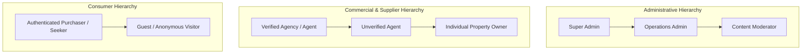
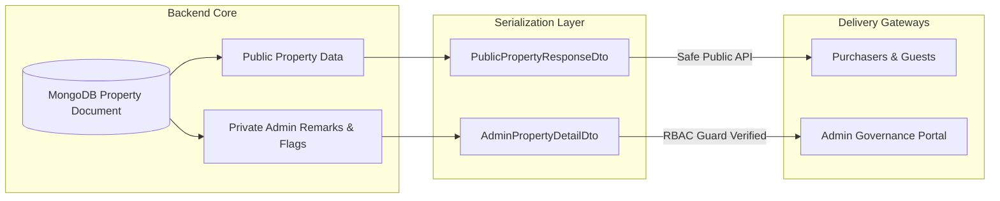

# CASA — User Roles & Role-Based Access Control (RBAC) Specification

## 1. Role Taxonomy & Hierarchy

CASA enforces a strict, hierarchical Role-Based Access Control (RBAC) architecture. Every authenticated actor in the system possesses a verified identity associated with one or more operational roles and permission sets.

---

## 2. Granular Role Definitions

### 2.1 Super Admin (`SUPER_ADMIN`)
- **Scope:** Highest technical and administrative governance authority.
- **Key Responsibilities:** Managing platform administrators, assigning roles, editing global system configurations, managing payment gateway webhooks, accessing financial logs, reviewing full audit trails, and hard-deleting records when legally required.

### 2.2 Operations Admin (`ADMIN`)
- **Scope:** Day-to-day marketplace management and commercial operations.
- **Key Responsibilities:** Managing category and location taxonomies, viewing platform revenue metrics, handling agent verification badges, managing featured listing overrides, and reviewing user disputes.

### 2.3 Content Moderator (`MODERATOR`)
- **Scope:** Trust, safety, and advertisement quality assurance.
- **Key Responsibilities:** Reviewing the pending listing queue, approving or rejecting property advertisements, adding private internal moderation notes, flagging duplicate or fraudulent media, and handling spam reports.

### 2.4 Verified Real Estate Agent / Agency (`VERIFIED_AGENT`)
- **Scope:** Professional commercial broker or real estate consultancy.
- **Key Responsibilities:** Batch property listing management, premium agency profile branding, verified trust badge display, purchasing subscription tiers, featured ad boosts, direct enquiry management, and Calendly viewing scheduling.

### 2.5 Unverified Agent (`AGENT`)
- **Scope:** Newly registered broker pending documentary or telephone verification.
- **Key Responsibilities:** Creating listings within standard freemium limits, managing enquiries, submitting verification documents (RERA/trade license) to achieve verified status.

### 2.6 Individual Property Owner (`PROPERTY_OWNER`)
- **Scope:** Private individual selling or leasing a personal property.
- **Key Responsibilities:** Creating and managing individual property advertisements, uploading smartphone photos, viewing approval status, and receiving direct buyer inquiries via WhatsApp/phone.

### 2.7 Authenticated Purchaser (`PURCHASER`)
- **Scope:** Registered property seeker authenticated via mobile OTP.
- **Key Responsibilities:** Searching, filtering, saving favorite properties, submitting formal enquiry tickets, managing notification preferences, and accessing saved search alerts.

### 2.8 Guest / Anonymous Visitor (`GUEST`)
- **Scope:** Unauthenticated web user or search crawler.
- **Key Responsibilities:** Browsing public listings, searching via filters, viewing property details, initiating WhatsApp click-to-chat links (requires OTP to view advertiser direct phone number).

---

## 3. Comprehensive RBAC Permission Matrix

| Resource Domain | Specific Operation | `SUPER_ADMIN` | `ADMIN` | `MODERATOR` | `VERIFIED_AGENT` | `AGENT` / `OWNER` | `PURCHASER` | `GUEST` |
| :--- | :--- | :---: | :---: | :---: | :---: | :---: | :---: | :---: |
| **Authentication** | Mobile OTP Request & Verify | Full | Full | Full | Full | Full | Full | Full |
| | Session Refresh & Logout | Full | Full | Full | Full | Full | Full | N/A |
| **User Management** | List / Search All Users | Full | Full | View Only | None | None | None | None |
| | Update User Role / Elevate | Full | Limited | None | None | None | None | None |
| | Verify / Assign Agent Badge | Full | Full | None | None | None | None | None |
| | Suspend / Ban User Account | Full | Full | Flag Only | None | None | None | None |
| | Update Own Profile | Full | Full | Full | Full | Full | Full | None |
| **Listings (Public)** | View Approved Listings | Full | Full | Full | Full | Full | Full | Full |
| | Search & Geospatial Query | Full | Full | Full | Full | Full | Full | Full |
| **Listings (Manage)**| Create Property Draft | Full | Full | None | Own | Own (Quota) | None | None |
| | Upload Property Media | Full | Full | None | Own | Own | None | None |
| | Submit for Approval | Full | Full | None | Own | Own | None | None |
| | Edit Active Property | Full | Full | None | Own* | Own* | None | None |
| | Mark as Sold / Inactive | Full | Full | None | Own | Own | None | None |
| | Delete Property Advertisement| Full | Full | None | Own (Soft) | Own (Soft) | None | None |
| **Moderation Queue** | View Pending Approvals | Full | Full | Full | None | None | None | None |
| | Approve / Reject Listing | Full | Full | Full | None | None | None | None |
| | Add Private Admin Remarks | Full | Full | Full | None | None | None | None |
| | View Private Admin Remarks | Full | Full | Full | None | None | None | None |
| **Taxonomy** | Create/Update Categories | Full | Full | None | None | None | None | None |
| | Manage Location Taxonomy | Full | Full | None | None | None | None | None |
| **Enquiries** | Submit Property Enquiry | Full | Full | Full | Full | Full | Full | OTP Req |
| | View Enquiries on Own Ads | Full | Full | None | Own | Own | None | None |
| | View All Platform Enquiries | Full | Full | View Only | None | None | None | None |
| **Favourites** | Add / Remove Favourites | Full | Full | Full | Full | Full | Full | None |
| | View Saved Shortlist | Full | Full | Full | Full | Full | Full | None |
| **Billing & Boosts**| Purchase Subscription/Boost | Full | Full | None | Full | Full | None | None |
| | View Own Invoices & Plans | Full | Full | None | Own | Own | None | None |
| | View Global Revenue / Plans| Full | Full | None | None | None | None | None |
| **System & Audit** | View System Audit Logs | Full | Full | View Limited| None | None | None | None |
| | Modify System Config / Keys | Full | None | None | None | None | None | None |

*\*Note: Editing critical fields (e.g., price, category, core media) on an `ACTIVE` listing triggers re-moderation (`PENDING_APPROVAL`) to prevent post-approval spam manipulation.*

---

## 4. Strict Security Boundary: Admin Data Leakage Prevention

### Architectural Enforcement Rules:
1. **DTO Separation:** Public endpoints (`/api/v1/properties/*`) must strictly bind responses to `PublicPropertyResponseDto`. Under no circumstances may raw Mongoose documents with administrative fields be returned.
2. **Redacted Attributes:** The following fields are strictly classified as `INTERNAL_ADMIN_ONLY`:
   - `adminRemarks` (Array of internal reviewer comments and rejection rationales).
   - `moderationHistory` (Timestamps, moderator IDs, and internal review audit steps).
   - `spamScore` & `fraudRiskScore`.
   - `advertiserIpAddress` & `userAgentHistory`.
   - `verificationDocuments` (Agent government IDs, tax numbers, trade licenses).
3. **Database Projections:** All public MongoDB queries must include explicit field exclusions (`.select('-adminRemarks -internalNotes -auditLog')`) to enforce defense-in-depth at the data layer.
